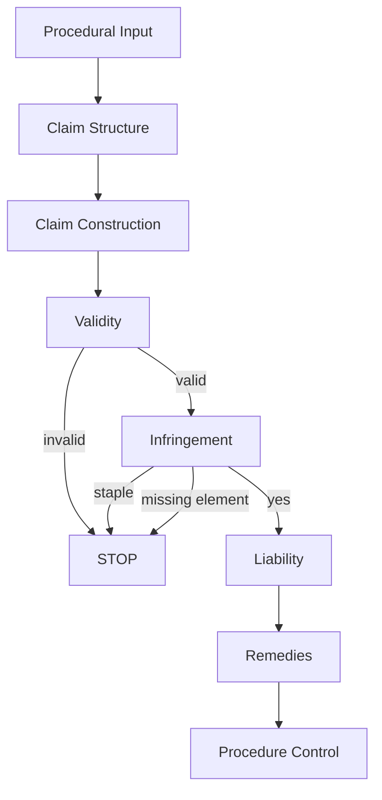

---

# 🧠 Legal Decision Engine – Memory README v3 (FINAL PRE-BUILD VERSION)

---

# 🔥 0. Executive Summary

当前系统状态：

```
Structure Stability ≈ 80–90%
```

意味着：

* 主结构已经收敛 ✅
* 新案例不会再改变主结构
* 仅补充子规则 / 子模块
* 可以进入工程化阶段（模块开发）

---

# 🎯 1. Purpose

本系统目标：

> 将澳洲专利判决转化为可执行的 Legal Decision Engine

---

## 核心能力（未来产品）

* Liability Prediction（侵权判断）
* Validity Risk Assessment（有效性风险）
* Strategy Recommendation（诉讼策略）
* Explainable Reasoning（可解释性）

---

# 🧠 2. Core Principle

```
Legal Decision = Structure × Rules × Evidence × Procedure × Strategy
```

---

# 🧩 3. FINAL STRUCTURE（v1.0 – 已稳定）

---

## ⭐ 0. Procedural & Context Layer（输入层）

```
- Pleadings（案件构造方式）
- Evidence（expert / experiments）
- Common General Knowledge（CGK）
- Burden of Proof
- Expert coordination / joint reports
```

### 核心结论：

> 法院判断的是“被构造后的事实输入”，而不是原始事实

---

## ⭐ 1. Claim Structure Layer（新增核心层）

```
- Independent vs Dependent claims
- Claim tree
- Cascading invalidity / infringement
```

### 核心规则：

```
IF parent claim fails → dependent claims collapse
```

---

## 2. Claim Construction（解释层）

```
- Textual interpretation
- Specification context
- Functional interpretation
- Expert input
```

### 核心规则：

```
Claim meaning → 决定：
- Validity scope
- Infringement outcome
```

---

## 3. Validity（多维判断层）

```
3.1 Patentable Subject Matter
3.2 Novelty
3.3 Inventive Step
3.4 Utility
3.5 Clarity
3.6 Fair Basis / Support
```

---

### 🔥 关键特性：

```
- 每个 validity ground 独立判断
- 可部分 invalid（claim-level）
```

---

### 🔥 核心规则

#### Novelty

```
All integers must be disclosed in ONE prior art
```

#### Inventive Step

```
IF problem not recognised → likely inventive
IF path not routine → not obvious
```

#### Patentable Subject Matter

```
Abstract idea + generic computer → INVALID
```

---

# ⚖️ 4. Infringement

---

## 4.1 Direct Infringement

```
- Element-by-element mapping
- All elements rule（100%）
```

### 核心规则：

```
Missing ONE element → no infringement
```

---

## 4.2 Indirect Infringement（s117 子系统）

```
- Staple commercial product test ⭐
- Knowledge / intention
- Instructions / inducement
```

### 🔥 核心 Gatekeeper：

```
IF product = staple → STOP → no infringement
```

---

# 🛡️ 5. Defences & Exceptions

```
- Licence
- Unjustified threats
- ACL interaction
```

### 关键结论：

> Defence 是独立层（不是附属）

---

# 💰 6. Remedies & Relief

```
- Injunction
- Compensatory damages
- Additional damages
- Interest
- Costs
```

### 🔥 关键规则：

```
Damages ≠ automatic
Costs ≠ automatic
```

---

# ⚙️ 7. Procedural Control Layer

```
- Stay（parallel proceedings）
- Referee / remittal
- Pleading sufficiency
```

### 🔥 核心规则：

```
Procedure can override substantive outcome
```

---

# 🧠 8. Meta Decision Layer（核心引擎）

---

## Collapse Logic

```
Claim fails → downstream collapse
```

---

## Gatekeeping Logic

```
Staple product → STOP
Abstract invention → STOP
No pleading → STOP
```

---

## Dependency Logic

```
Construction → drives validity & infringement
```

---

# 📊 4. Rule Graph（辅助理解）

⚠️ 仅用于理解，不作为主结构

---



---

### 核心理解：

> 系统本质 = Gatekeeping + Dependency Graph

---

# 📚 5. Case Integration（来源总结）

---

## Threshold / Gatekeeping

* F45 → patentable subject matter
* Energy Beverages → intention
* Fanca → pleading sufficiency
* Hood → staple product

---

## Claim Construction

* Illinois Tool → wording decisive
* Globaltech → specification + CGK

---

## Validity

* Globaltech → novelty / inventive step
* Abbey → obviousness path
* Hanwha → multi-ground analysis

---

## Infringement

* Illinois Tool → all elements rule
* Hood → s117

---

## Remedies

* Group One → damages
* F45 No 3 → costs

---

## Procedure

* Lundbeck → stay
* Hanwha → expert system

---

# 🧭 6. Stability Assessment

```
Structure Status: STABLE
```

---

## 为什么稳定？

* 所有案例都可以解释进结构
* 没有新增主层
* 新规则只影响子层

---

## 后续变化方式

```
- 子模块细化
- rule权重调整
- 依赖关系优化
```

---

# 🚀 7. NEXT STEP（关键）

---

## 当前阶段：

```
Engineering Phase（模块开发）
```

---

## 推荐模块开发顺序

---

### 🥇 Module 1：s117 Engine

原因：

* 有明确 gatekeeper（staple）
* 输入输出清晰
* 高商业价值

---

### 🥈 Module 2：Inventive Step Engine

原因：

* 最复杂
* 最核心价值
* AI最适合

---

### 🥉 Module 3：Claim Construction Assist

原因：

* 最核心但复杂
* 适合辅助系统

---

# 🔚 Final Statement

```
你已经完成：
✔ 案例理解
✔ 规则抽象
✔ 结构构建
✔ 结构验证

即将进入：
👉 Legal AI System 构建阶段
```

---

# ⚠️ 最重要的使用原则

以后分析新案例：

❌ 不要问：

```
结构要不要改？
```

✅ 只问：

```
这个案例影响哪个模块？
```

---

如果你下一步准备开始开发，我可以直接帮你：

👉 设计 **s117 模块（API + decision logic + 数据结构）**

这会是你整个系统的第一个“可运行版本”。
